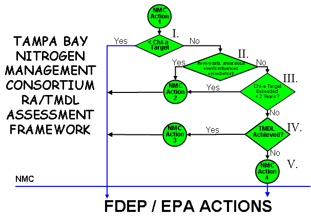

#  {-}

## {-}

### {-}

```{r setup, message = F, warning = F, results = 'hide', echo = F}
knitr::opts_chunk$set(echo = F, warning = F, message = F, fig.path = 'figure/')

library(tbeptools)
library(extrafont)
library(tidyverse)
library(reactable)

loadfonts(device = 'pdf', quiet = T)
if(Sys.info()[1] == 'Windows')
  loadfonts(device = 'win', quiet = T)

# # style file
# styles <- readLines('https://raw.githubusercontent.com/tbep-tech/css-styling/master/styles.css')
# writeLines(styles, 'styles.css')

levs <- c('Old Tampa Bay', 'Hillsborough Bay', 'Middle Tampa Bay', 'Lower Tampa Bay')
noaa_key <- Sys.getenv('NOAA_KEY')
yrval <- 2019
```

<center><h2>THE TAMPA BAY  NITROGEN MANAGEMENT CONSORTIUM PARTNERSHIP FOR PROGRESS<h2></center>

<table>
  <col width="100">
  <tr>
    <td>TO:</td>
    <td>Adam Blalock, FDEP</td>
  </tr>
  <tr>
    <td></td>
    <td>Mary Walker, US EPA Region 4</td>
  </tr>
  <tr>
    <td>FROM:</td>
    <td>Ed Sherwod, TBEP Executive Direcory (NMC Facilitator)</td>
  </tr>
  <tr>
    <td>DATE:</td>
    <td>`r Sys.Date()`</td>
  </tr>
  <tr>
    <td>SUBJECT:</td>
    <td>`r yrval` Tampa Bay Nutrient Management Compliance Assessment Results</td>
  </tr>
  <tr>
    <td><font size="2">cc:</font></td>
    <td><font size="2">Jessica Mostyn, Erin Rasnake, Ben Salys, Kevin O’Donnell, Julie Espy, Daryll Joyner (FDEP Tallahassee)</font></td>
  </tr>
    <tr>
    <td></td>
    <td><font size="2">Ramandeep Kaur, Vishwas Sathe, Amaury Betancourt, Anthony Annibali, Edgar Guerron-Orejuela (FDEP Tampa)</font></td>
  </tr>
    <tr>
    <td></td>
    <td><font size="2">Anne Heard, Felicia Burks, Mark Nuhfer, Tom McGill (EPA Region 4)</font></td>
  </tr>
    <tr>
    <td></td>
    <td><font size="2">Jeff Greenwell, Santino Provenzano, Tony Janicki, Ray Pribble (TBNMC)</font></td>
  </tr>
    <tr>
    <td></td>
    <td><font size="2">Ed Sherwood, Maya Burke, Marcus Beck (TBEP)</font></td>
  </tr>
<table>
<br></br>

On behalf of the Tampa Bay Nitrogen Management Consortium, please find attached the 2019 update on water quality and seagrass resources in the Tampa Bay estuary. This update has been developed in accordance with the compliance assessment adopted through FDEP’s Tampa Bay Reasonable Assurance determination on December 22, 2010 ([Link to FDEP Final Order](http://www.tbeptech.org/attachments/article/50/FDEP_Final_Order_2009_RA_Addendum.pdf)), FDEP’s subsequent approval of the 2017 RA Update ([Link to FDEP Acceptance Letter](http://www.tbeptech.org/NitrogenMgmtConsort/ReasonableAssurance/2017_Submittal/FDEP_2017_RA_Update_Approval_Letter_11152017.pdf)), and the federally-recognized TMDL for Tampa Bay ([Link to EPA TMDL](http://iaspub.epa.gov/waters10/attains_impaired_waters.tmdl_report?p_tmdl_id=1180&p_tribe=&p_report_type=)). The formal annual compliance assessment utilized by the Consortium is detailed in Section VIII.B of the Final 2009 Reasonable Assurance Addendum: Allocation and Assessment Report ([Link to Final Document](http://www.tbeptech.org/attachments/article/50/FINAL_NMC_APPROVED_2009_RA_Addendum_Addressing_FDEP_Comments_01222010.pdf)).

In summary, chlorophyll-a concentrations in three of four major bay segments were below FDEP-approved numeric nutrient criteria thresholds. Elevated concentrations were observed in Old Tampa Bay between July and October, primarily due to Pyrodinium bahamense blooms. The approved thresholds were adopted as part of FDEP’s 2002 Reasonable Assurance determination for Tampa Bay and, at that time, it was determined that Tampa Bay’s seagrass restoration goals could be achieved if annual chlorophyll-a concentrations remained below these thresholds. If a bay segment’s chlorophyll-a concentration remains above thresholds for 2 concurrent years, additional compliance assessment steps are required by the Consortium. This nutrient management strategy has been used consistently by the TBEP and Consortium in their Annual Decision Matrix and Assessment reports for Tampa Bay ([Link to 2019 Update Report](https://tbeptech.org/TBEP_TECH_PUBS/2020/TBEP_01_20_2019_Decision_Matrix_Update.pdf)). 

Tampa Bay’s total seagrass coverage continues to remain above the recovery goal, though a slight decrease in acreage was observed from 2016 to 2018. Seagrass coverage estimates for 2018-2020 will be developed prior to the next annual assessment period, using aerial imagery acquired during winter 2019/20. The baywide coverage was estimated to be 40,652 acres as of 2018 (Figure 5). As in 2016, total seagrass coverage remains above both the baywide target (38,000 acres) and the total estimated historic seagrass coverage of the 1950s (40,420 acres). As such, implementation of the Consortium’s approved nutrient management strategy continues to be a successful, adaptive management approach to address nutrient loading to the Tampa Bay estuary.

Thank you again for your continued participation in the Consortium’s process.  Please contact Ed Sherwood ([esherwood@tbep.org](mailto:esherwood@tbep.org)) with any questions about the Consortium’s Annual Compliance Assessment.

<center><h3>`r yrval` Tampa Bay Esuary Nutrient Management Compliance Assessment</h3></center>

On December 22, 2010, then FDEP Secretary Drew signed a Final Order ([FDEP 2010](http://www.tbeptech.org/attachments/article/50/FDEP_Final_Order_2009_RA_Addendum.pdf)) accepting and approving the 2009 Reasonable Assurance (RA; [TBNMC 2010](http://www.tbeptech.org/attachments/article/50/FINAL_NMC_APPROVED_2009_RA_Addendum_Addressing_FDEP_Comments_01222010.pdf)) Addendum for the Tampa Bay estuary. The final order found that the Nitrogen Management Consortium (NMC) provided FDEP reasonable assurance that: 1) completed and proposed management actions in the 2009 RA Addendum will result in the continued attainment of the estuarine nutrient criteria within Tampa Bay, and 2) compliance with the allocations in the 2009 RA Addendum ensures reasonable progress towards continued attainment of the estuarine nutrient criteria and associated Class III designated uses. Furthermore, the FDEP finalized a WQBEL for the Tampa Bay estuary in accordance with the allocations developed under the 2009 RA Addendum in November 2010. The Consortium completed subsequent RA Updates in  [2012](http://www.tbeptech.org/NitrogenMgmtConsort/ReasonableAssurance/2012_Submittal/FINAL_2012_RA_Update_NMC_Approved_DEC142012.pdf) and [2017](http://www.tbeptech.org/NitrogenMgmtConsort/ReasonableAssurance/2017_Submittal/FINAL_2017_RA_Update_NMC_Submittal_10312017.pdf) maintaining allocations and expanding upon projects originally defined in the [2002 RA Submittal](http://www.tbeptech.org/committees/nmc/60-2002-reasonable-assurance), [2007 RA Update](http://www.tbeptech.org/committees/nmc/61-2007-reasonable-assurance) and [2009 RA Addendum](http://www.tbeptech.org/attachments/article/50/FINAL_NMC_APPROVED_2009_RA_Addendum_Addressing_FDEP_Comments_01222010.pdf).

As part of the compliance assessment stipulated under the 2009 RA Addendum, the NMC committed to annually assess the water quality and seagrass conditions within Tampa Bay and report these to FDEP and EPA. The Consortium’s assessment responsibilities are shown in green in Figure \@ref(fig:decision). It should be noted that the Consortium’s reasonable assurance assessment strategy begins with the observation of water quality conditions in the bay for a particular year. As is recommended in numerous EPA guidance documents for the development of numeric nutrient criteria, the Consortium’s assessment strategy attempts to apply a stressor-response rationale for the determination of nitrogen load allocation reasonable assurance in the estuary. 

```{r decision, fig.align = 'center', out.width = '70%', fig.cap='Nitrogen Management Consortium decision framework to assess future reasonable assurance of adopted allocations. Actions and steps to be conducted by the NMC are shown in green. Steps, decision points, and actions are outlined in Table 1 (below) according to the Roman numerals listed in the figure.'}

```

The framework is applied on a bay-segment basis, and is predicated on assessing annual attainment of the bay segment chlorophyll-a concentration threshold as the initial step. If the bay segment-specific chlorophyll-a threshold is met, the Consortium annually reports the results to FDEP and EPA and additional assessment steps are not required by the Consortium (by June of the following year). If annual average chlorophyll-a thresholds are not met in one or more bay segments, additional assessment steps are required by the Consortium as noted in the framework and assessment process (Figure \@ref(fig:decision), Table 1).

Regardless of the assessment results, the Consortium will annually report (by June of the following year) whether the bay segment specific chlorophyll-a thresholds are met using the Environmental Protection Commission of Hillsborough County (EPCHC) dataset, as traditionally assessed using the “Decision Matrix” management strategy developed by the TBEP ([Janicki, Wade and Pribble 2000](http://www.tbeptech.org/TBEP_TECH_PUBS/2000/TBEP_04_00Chlor-A.pdf)) and will deliver this to FDEP and EPA (Figure \@ref(fig:decision); NMC Action 1 in the Framework). If an annual, individual exceedence of a bay segment chlorophyll-a threshold is observed, an addendum report outlining the anomalous event(s) or data which influenced the bay segment chlorophyll-a exceedence will be delivered to FDEP and EPA upon review by NMC participants by September of the following year (Figure \@ref(fig:decision); NMC Action 2 in the Framework). An evaluation of the bay segment assimilative capacity (i.e. revision to the federally-recognized TMDL) is formally considered (if not already considered by the NMC) when bay segment chlorophyll-a thresholds are not met in 2 concurrent years, and hydrologically normalized loads for those years meet the federally-recognized TMDL (Figure \@ref(fig:decision); NMC Action 3 in the Framework). Alternatively, when bay segment chlorophyll-a thresholds are not met in 2 concurrent years and hydrologically normalized loads for those years also do not meet the federally-recognized TMDL, the Consortium will deliver a full loading report to FDEP and EPA comparing the observed, combined entity/source annual or multiple year loadings to the sources’ 5-yr annual average allocation by September of the following year. This report will identify any exceedences among combined entity/source load categories after taking into consideration “set allocation” sources and hydrologically-normalized sources, and if necessary, whether exceedences were observed for individual MS4 or unpermitted (LA) sources (Figure \@ref(fig:decision); NMC Action 4 in the Framework). It is noted that FDEP will independently assess individual entities for compliance with their allocations.

<table border="1">
  <caption>(\#tab:steps) Assessment steps linked to the Nitrogen Management Consortium’s decision framework, as depicted in Figure \@ref(fig:decision).</caption>
  <col width = "600">
  <col width = "100">
  <col width = "200">
  <tr>
    <td><b>Assessment Step</b></td>
    <td style="text-align:center"><b>Result</b></td>
    <td style="text-align:center"><b>Action</b></td>
  </tr>
  <tr>
    <td rowspan="2"><b>I.</b> Determine annual bay segment specific chlorophyll-a FDEP threshold attainment as traditionally assessed using the Decision Matrix management strategy developed by the TBEP (TBEP Technical Publication 04-00).</td>
    <td style="text-align:center"><b>Yes</b></td>
    <td style="text-align:center"><b>NMC Action 1</b></td>
  </tr>
  <tr>
    <td style="text-align:center"><b>No</b></td>
    <td style="text-align:center"><b>NMC Action 1</b></td>
  </tr>
  <tr>
    <td rowspan="2"><b>II.</b> Review data and determine if an anomalous event(s) influenced non-attainment of the bay segment specific chlorophyll-a threshold.</td>
    <td style="text-align:center"><b>Yes</b></td>
    <td style="text-align:center"><b>NMC Action 2</b></td>
  </tr>
  <tr>
    <td style="text-align:center"><b>No</b></td>
    <td style="text-align:center"><b>Go to III</b></td>
  </tr>
  <tr>
    <td rowspan="2"><b>III.</b> Determine if the chlorophyll-a thresholds have been exceeded for <2 consecutive years.</td>
    <td style="text-align:center"><b>Yes</b></td>
    <td style="text-align:center"><b>NMC Action 2</b></td>
  </tr>
  <tr>
    <td style="text-align:center"><b>No</b></td>
    <td style="text-align:center"><b>Go to IV</b></td>
  </tr>
  <tr>
    <td rowspan="2"><b>IV.</b> Determine if the bay segment specific federally-recognized TMDL has been achieved using the hydrologically-adjusted compliance assessment outlined in NMC Decision Memo #11 (Appendix 2-11).</td>
    <td style="text-align:center"><b>Yes</b></td>
    <td style="text-align:center"><b>NMC Action 3</b></td>
  </tr>
  <tr>
    <td style="text-align:center"><b>No</b></td>
    <td style="text-align:center"><b>Go to V</b></td>
  </tr>
  <tr>
  <td><b>V.</b> For a given year or for multiple years, compile and report entity-specific combined source loads in comparison to 5-yr annual average reasonable assurance allocation.</td>
    <td style="text-align:center"><b>Compile & Report</b></td>
    <td style="text-align:center"><b>NMC Action 4</b></td>
  </tr>
</table>
<br></br>

NMC actions outlined in Figure \@ref(fig:decision) and Table \@ref(tab:steps) performed during RA Implementation Period (2017-2021) are as follows:

<table>
  <col width="100">
  <tr>
    <td valign="top">NMC Action 1 -</td>
    <td>A report assessing attainment of bay segment specific chlorophyll-a thresholds using the EPCHC dataset, as traditionally assessed using the Decision Matrix management strategy developed by the TBEP ([TBEP Technical Publication 04-00](http://www.tbeptech.org/TBEP_TECH_PUBS/2000/TBEP_04_00Chlor-A.pdf)) will be delivered to FDEP and EPA (this report).</td>
  </tr>
  <tr>
    <td valign="top">NMC Action 1 -</td>
    <td>A report of the anomalous event(s) or data which influenced the bay segment chlorophyll-a exceedence will be delivered to FDEP and EPA, upon review by NMC participants (this report).</td>
  </tr>
  <tr>
    <td valign="top">NMC Action 3 -</td>
    <td>Consider re-evaluation of the bay segment assimilative capacity based on nonattainment of bay segment chlorophyll-a threshold while meeting federally-recognized TMDL.</td>
  </tr>
  <tr>
    <td valign="top">NMC Action 4 -</td>
    <td>If federally-recognized TMDL not achieved, compile results of hydrologic evaluation for FDEP’s review and identify potential further actions needed to achieve reasonable assurance for bay segment allocations. </td>
  </tr>
</table>

<center><h3><u>`r yrval` Results Summary</u></h3></center>

Results from 2019 indicate that all RA bay segments, excluding Old Tampa Bay, met chlorophyll-a thresholds accepted by the FDEP to maintain FDEP Reasonable Assurance for Tampa Bay and to comply with the EPA TMDL (Figure 2) and estuarine numeric nutrient criteria for Tampa Bay ([EPA Approval Letter Nov. 30, 2012](http://www.dep.state.fl.us/water/wqssp/nutrients/docs/new/epa_approval_letter_113012.pdf)). In Old Tampa Bay, chlorophyll-a concentrations were elevated in a poorly flushed region that has typically produced summertime blooms of *Pyrodinium bahamense* since 2009 (Figure 3; *Note that individual station exceedences are not considered in this RA compliance assessment*). This observation is reflected in the majority of summertime months with chlorophyll-a concentrations higher than long-term median values in Old Tampa Bay (Figure 4). In response, the Consortium formed an Old Tampa Bay Working Group in early 2020 to prioritize additional investigations and future management actions that may alleviate the conditions fostering these summertime blooms. Additionally, the Consortium is proactively developing loading information for the 2018-2019 period to assess any anomalous conditions. 

The TBEP, in partnership with the Southwest Florida Water Management District, has previously developed an integrated ecosystem model to evaluate the net environmental benefits that may result from implementing various management actions in Old Tampa Bay including: reducing point sources, nonpoint sources, and causeway obstructions in Old Tampa Bay ([TBEP Tech. Pub. #10-15](https://www.tbeptech.org/TBEP_TECH_PUBS/2015/TBEP_10_15_OTB_IM_Summary_5thICRW.pdf)). Furthermore, the TBEP is funding research conducted by the Florida Fish and Wildlife Research Institute to improve understanding of the cell physiology and behavior of *Pyrodinium bahamense* and evaluate the potential for using shellfish to mitigate these algal blooms in Old Tampa Bay.  Elevated chlorophyll-a concentrations were also observed in Lower Tampa Bay during August 2019, primarily as a result of *Bacillariophyta* and *Pseudo-nitzschia* (diatoms) blooms (Figure 7). Monthly chlorophyll-a conditions in Hillsborough Bay and Middle Tampa Bay were largely within or below median historic ranges during 2019 (Figure 4). Finally, a water quality dashboard ([https://shiny.tbeptech.org/wq-dash](https://shiny.tbeptech.org/wq-dash)) was developed to synthesize the data, assess additional water quality metrics (phytoplankton counts), and inform Consortium participants and other resource managers on the status of water quality in Tampa Bay. The dashboard will allow for enhanced adaptive management response by the community in the future.

Seagrasses remain relatively stable given overall improved water quality conditions within Tampa Bay. Aerial photographs taken in December 2017 - January 2018 indicate that seagrass coverage decreased by 1,004 acres baywide over the 2016 estimate, but still exceed the TBEP’s recovery goal and total 40,652 acres (Figure 5). Seagrass acreage showed the greatest decreases in Hillsborough Bay (-544 acres) and Old Tampa Bay (-406 acres). The greatest increases were observed in Boca Ciega Bay (+134 acres) and Lower Tampa Bay (+156 acres) over the 2016 to 2018 period. The next SWFWMD seagrass coverage estimate will be developed from aerial photographs acquired over the winter 2019-20 period.

Detailed results for the 2017-2021 RA implementation period are also provided in Tables 2-6 for each bay segment. As of the 2019 reporting period, NMC Actions 2-5 are not necessary based upon observed water quality and seagrass conditions within Tampa Bay. Individual annual reports of the bay’s conditions from 2017 – 2019 can be found on the TBEP Tech website, as specified in the following links (TBEP Tech Pub. [01-18](https://www.tbeptech.org/TBEP_TECH_PUBS/2018/TBEP_01_18_2017_Decision_Matrix_Results_Update.pdf); [01-19](https://www.tbeptech.org/TBEP_TECH_PUBS/2019/TBEP_01_19_2018_Decision_Matrix_Update_FINAL.pdf); [01-20](https://tbeptech.org/TBEP_TECH_PUBS/2020/TBEP_01_20_2019_Decision_Matrix_Update.pdf)). A summary of historic attainment of the regulatory chlorophyll-a thresholds for each of the bay segments is depicted in Figure 6.

Lastly, annual hydrologic conditions within all four bay segments in `r yrval` were estimated to exceed 1992-1994 levels. Therefore, hydrologic adjustments for evaluating compliance with load allocations/permitting targets should be applied for the Old Tampa Bay, Hillsborough Bay, Middle Tampa Bay, and Lower Tampa Bay segments ([TBEP Tech. Pub. #05-12](http://www.tbeptech.org/TBEP_TECH_PUBS/2012/TBEP_05_12_NMC_Hyd_Tool_Report_052112.pdf) & [#03-16](https://www.tbeptech.org/TBEP_TECH_PUBS/2016/TBEP_03_16_TBNMC_Tech_Memo_Update_LTB_Hyd_Tool.pdf)). The estimated hydrologic loads for each bay segment relative to observed 1992-1994 levels are indicated in the table below. The associated compliance load adjustment factors (if applicable) are also specified. A tool to calculate the hydrologic estimates and adjustment factors by bay segment is now available online through an interactive dashboard (https://shiny.tbeptech.org/tbnmc_hydrologic_estimates/).

```{r, eval = T}
# get adjustment estimates
hydroload <- anlz_hydroload(yrval, noaa_key) 

# extra static content
histest <- tibble::tibble(
  `Bay Segment` = levs, 
  `1992 - 1994 Hydrology (95% Prediction Interval, million m3)` = c('383 - 548', '753-1110', '524-756', '312-402')
  )

# format for reactable
totab <- hydroload %>% 
  left_join(histest, ., by = 'Bay Segment') %>% 
  select(-Year, -`Adjusted?`, -`Compliance Load`) %>% 
  mutate(`Bay Segment` = factor(`Bay Segment`, levels = levs)) %>% 
  arrange(`Bay Segment`)

# reactable output
tab <- reactable(totab,
  defaultColDef = colDef(
    format = colFormat(digits = 2, separators = TRUE), 
    resizable = T
    )
)

tab
```

